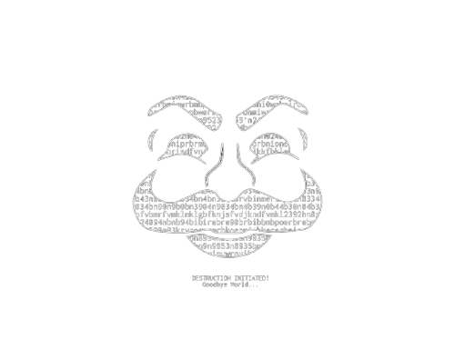
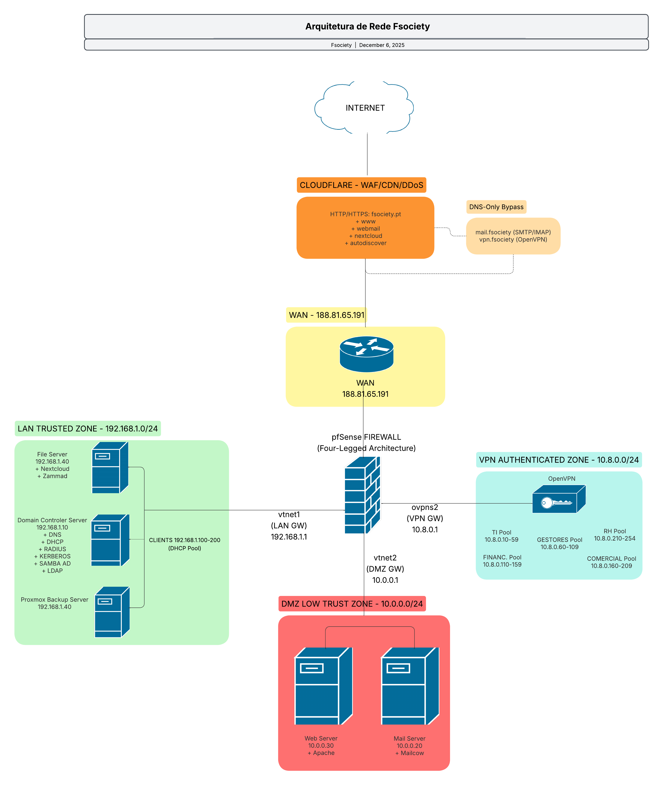

<div align="center">

<div align="center">
  


</div>

# 🔐 FSociety.pt

### Infraestrutura Empresarial Segura | Four-Legged Firewall Architecture

[](https://choosealicense.com/licenses/mit/)
[](https://ryantech00.github.io/fsociety-infrastructure/)
[](https://www.pfsense.org/)
[](https://www.proxmox.com/)
[](https://www.crowdsec.net/)
[](https://www.cloudflare.com/)

*Projeto universitário de implementação de infraestrutura de rede empresarial com defesa em profundidade*

**ESTG - Instituto Politécnico do Porto | 2024/2025**

---

[📖 Documentação](https://ryantech00.github.io/fsociety-infrastructure/) •
[🔧 Wiki](https://github.com/RyanTech00/fsociety-infrastructure/wiki) •
[📊 Arquitetura](#-arquitetura)

</div>

---

## 📋 Sobre o Projeto

Este projeto implementa uma **infraestrutura de rede empresarial completa** para a empresa fictícia **FSociety.pt**, demonstrando conceitos avançados de segurança e administração de sistemas:

- 🛡️ **Segurança Perimetral** - Firewall stateful com segmentação em 4 zonas (WAN/LAN/DMZ/VPN)
- 🔐 **Gestão de Identidades** - Active Directory com autenticação LDAP centralizada
- 🌐 **Serviços Corporativos** - Email, Web, VPN, Colaboração de Ficheiros
- ☁️ **Proteção Multi-Camada** - Cloudflare (Edge) + pfSense (Perímetro) + CrowdSec (Host)
- 📊 **Deteção de Ameaças** - 57+ cenários de deteção com blocklists comunitárias (~70k IPs)

---

## 🏗️ Arquitetura

### Diagrama da Infraestrutura

<div align="center">



*Arquitetura Four-Legged Firewall com segmentação WAN/LAN/DMZ/VPN*

</div>

### Diagrama de Rede

```
                              ┌─────────────────┐
                              │    INTERNET     │
                              └────────┬────────┘
                                       │
              ┌────────────────────────┼────────────────────────┐
              │                        │                        │
              ▼                        ▼                        ▼
     ┌─────────────────┐     ┌─────────────────┐      ┌─────────────────┐
     │   CLOUDFLARE    │     │   DNS Only      │      │   DNS Only      │
     │  (HTTP/HTTPS)   │     │   (SMTP/IMAP)   │      │   (OpenVPN)     │
     │  WAF + CDN      │     │                 │      │                 │
     └────────┬────────┘     └────────┬────────┘      └────────┬────────┘
              │                       │                        │
              └───────────────────────┼────────────────────────┘
                                      │
                                      ▼
                    ┌────────────────────────────────┐
                    │            pfSense             │
                    │      Four-Legged Firewall      │
                    │                                │
                    │   WAN: 188.81.65.191 (Pública) │
                    │   ┌─────┬─────┬─────┐          │
                    │   │ LAN │ DMZ │ VPN │          │
                    └───┴──┬──┴──┬──┴──┬──┴──────────┘
                           │     │     │
         ┌─────────────────┘     │     └─────────────────┐
         │                       │                       │
         ▼                       ▼                       ▼
┌─────────────────┐    ┌─────────────────┐    ┌─────────────────┐
│      LAN        │    │      DMZ        │    │      VPN        │
│ 192.168.1.0/24  │    │  10.0.0.0/24    │    │  10.8.0.0/24    │
├─────────────────┤    ├─────────────────┤    ├─────────────────┤
│ ┌─────────────┐ │    │ ┌─────────────┐ │    │ Por Grupo AD:   │
│ │  Samba AD   │ │    │ │ Mail Server │ │    │                 │
│ │ DNS + DHCP  │ │    │ │  (Mailcow)  │ │    │ • TI: .10-.59   │
│ │ FreeRADIUS  │ │    │ └─────────────┘ │    │ • Gestão: .60+  │
│ │ CrowdSec    │ │    │                 |    │ • Finance: .110+│
│ └─────────────┘ │    │ ┌─────────────┐ │    │ • Comercial     │
│ ┌─────────────┐ │    │ │ Web Server  │ │    │ • RH: .210+     │
│ │  Nextcloud  │ │    │ │  (Nginx)    │ │    │                 │
│ │   + LDAP    │ │    │ │ CrowdSec    │ │    │ Autenticação:   │
│ │ CrowdSec    │ │    │ │ 3 Bouncers  │ │    │ RADIUS + LDAP   │
│ └─────────────┘ │    │ └─────────────┘ │    │                 │
│ ┌─────────────┐ │    │                 │    │                 │
│ │Proxmox Backup││    │                 │    │                 │
│ └─────────────┘ │    │                 │    │                 │
└─────────────────┘    └─────────────────┘    └─────────────────┘
```

### Camadas de Segurança (Defense in Depth)

```
┌─────────────────────────────────────────────────────────────────────────┐
│  CAMADA 1: EDGE (Cloudflare)                                            │
│  ├── WAF com OWASP Managed Rules + Regras Personalizadas                │
│  ├── Mitigação DDoS (L3/L4/L7)                                          │
│  ├── CDN com cache em 330+ datacenters                                  │
│  └── SSL/TLS Full (Strict) com TLS 1.3                                  │
├─────────────────────────────────────────────────────────────────────────┤
│  CAMADA 2: PERÍMETRO (pfSense)                                          │
│  ├── Stateful Firewall com Default Deny                                 │
│  ├── Segmentação em 4 zonas isoladas                                    │
│  ├── NAT/Port Forwarding controlado                                     │
│  └── VPN com autenticação RADIUS/LDAP                                   │
├─────────────────────────────────────────────────────────────────────────┤
│  CAMADA 3: HOST (CrowdSec)                                              │
│  ├── 57+ cenários de deteção (CVEs, brute-force, scans)                 │
│  ├── 3 Bouncers: Cloudflare + Firewall + Nginx                          │
│  ├── Community Blocklist: ~70.000 IPs maliciosos                        │
│  └── Análise comportamental de logs em tempo real                       │
└─────────────────────────────────────────────────────────────────────────┘
```

---

## 🛠️ Stack Tecnológica

### Infraestrutura Core

| Componente | Tecnologia | Função |
|------------|------------|--------|
| **Virtualização** | Proxmox VE 8.x | Hypervisor Type-1 com KVM/LXC |
| **Firewall** | pfSense CE 2.8.1 | Segmentação e controlo de tráfego |
| **Identidade** | Samba AD DC 4.x | Active Directory + DNS + DHCP |
| **Autenticação** | FreeRADIUS 3.x | RADIUS para VPN e WiFi |

### Serviços

| Componente | Tecnologia | Localização |
|------------|------------|-------------|
| **Email** | Mailcow (Postfix + Dovecot) | DMZ |
| **Email Gateway** | Proxmox Mail Gateway 8.x | DMZ |
| **Web Server** | Nginx | DMZ |
| **Ficheiros** | Nextcloud 32.0.0 + LDAP | LAN |
| **Suporte** | Zammad 6.5.2 | LAN |
| **Backup** | Proxmox Backup Server | LAN |
| **VPN** | OpenVPN 2.x | pfSense |

### Segurança

| Camada | Tecnologia | Proteção |
|--------|------------|----------|
| **Edge** | Cloudflare | WAF, DDoS, CDN |
| **Perímetro** | pfSense | Firewall, NAT, VPN |
| **Host** | CrowdSec | IDS/IPS, Blocklists |
| **Email** | PMG + SPF/DKIM/DMARC | Anti-spam, Anti-malware |

---

## 📊 Métricas de Segurança

| Métrica | Valor |
|---------|-------|
| **Cenários CrowdSec Ativos** | 57+ (incluindo CVEs críticas) |
| **IPs na Blocklist** | ~70.000 (CAPI community) |
| **Ameaças Mitigadas (24h)** | 234 pelo Cloudflare |
| **Pedidos Bloqueados** | 411 pelo Nginx Bouncer |
| **Zonas de Segurança** | 4 (WAN/LAN/DMZ/VPN) |

---

## 📁 Estrutura do Repositório

```
fsociety-infrastructure/
├── 📄 README.md                    # Este ficheiro
├── 📄 LICENSE                      # Licença MIT
│
└── 📁 docs/                        # Documentação (GitHub Pages)
    ├── index.md                    # Página inicial
    ├── 03-pfsense/                 # 10 documentos
    ├── 04-domain-controller/       # 9 documentos
    ├── 05-servidor-ficheiros/      # Nextcloud + Zammad
    ├── 06-webserver/               # Nginx Reverse Proxy
    └── assets/images/              # Imagens do projeto
```

---

## 📖 Documentação

| Recurso | Descrição |
|---------|-----------|
| 📚 **[GitHub Pages](https://ryantech00.github.io/fsociety-infrastructure/)** | Documentação formatada e navegável |
| 📝 **[Wiki](https://github.com/RyanTech00/fsociety-infrastructure/wiki)** | Guias passo a passo detalhados |

### Guias Principais

| Componente | Documentação | Descrição |
|------------|--------------|-----------|
| 🛡️ **pfSense** | [docs/03-pfsense/](docs/03-pfsense/) | Firewall, VPN, NAT, 72 regras |
| 🖥️ **Domain Controller** | [docs/04-domain-controller/](docs/04-domain-controller/) | Samba AD, DNS, DHCP, RADIUS |
| 📁 **Servidor Ficheiros** | [docs/05-servidor-ficheiros/](docs/05-servidor-ficheiros/) | Nextcloud 32.0, Zammad 6.5 |
| 🌐 **Webserver** | [docs/06-webserver/](docs/06-webserver/) | Nginx, 6 Reverse Proxies, SSL |

### Destaques Técnicos

- 🔄 **[RADIUS Accounting Daemon](docs/03-pfsense/10-accounting-daemon.md)** - Script para contabilização de sessões VPN (RFC 2866)
- 🔐 **[Hierarquia VPN por Grupos AD](docs/03-pfsense/06-openvpn.md)** - Pools de IP baseados em grupos do Active Directory
- 🌍 **[Geo-Access Control](docs/06-webserver/04-proxy-nextcloud.md)** - Controlo de acesso por localização (internos vs externos)
- 🛡️ **[CrowdSec Multi-Server](docs/04-domain-controller/07-crowdsec.md)** - IDS/IPS distribuído com 57+ cenários

---

## 🎓 Informação Académica

| Campo | Informação |
|-------|------------|
| **Instituição** | ESTG - Instituto Politécnico do Porto |
| **Unidade Curricular** | Administração de Sistemas II |
| **Ano Letivo** | 2024/2025 |
| **Autores** | Ryan Barbosa, Hugo Correia, Igor Araújo |
| **Domínio** | fsociety.pt |

---

## 📄 Licença

Este projeto está licenciado sob a [MIT License](LICENSE).

---

<div align="center">


*"Control is an illusion, and whoever has the illusion has the control."*

**[⬆ Voltar ao topo](#-fsocietypt)**

---

<sub>🔐 FSociety.pt - Infraestrutura Empresarial Segura | Projeto Universitário em Cibersegurança, Redes e Sistemas Informáticos na ESTG/IPP - 2026/2025</sub>

</div>
